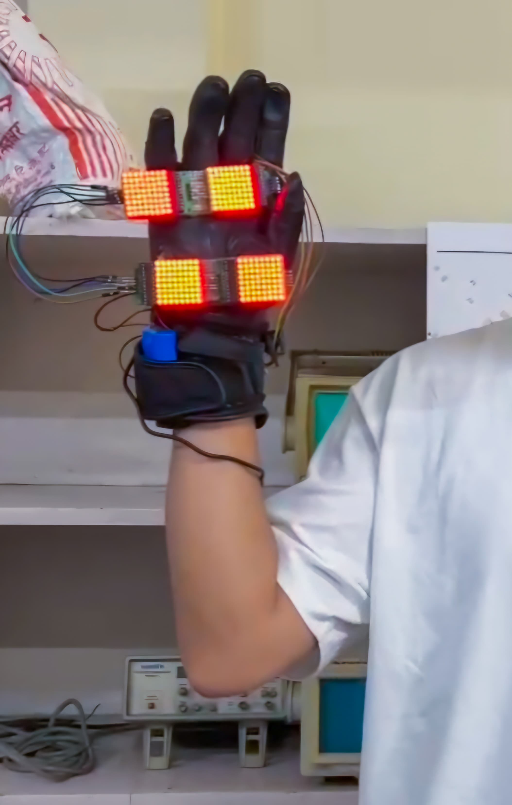
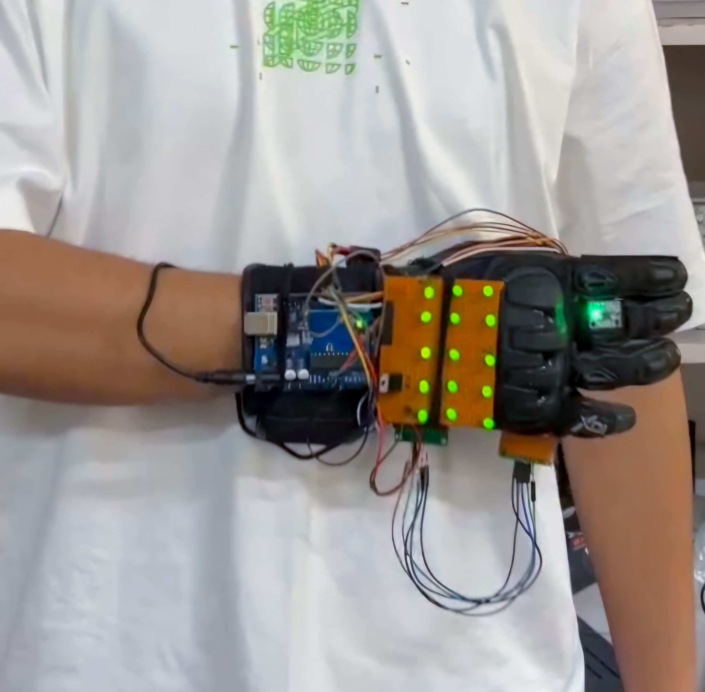

# W.A.V.E — Wearable Automated Visual Emitter
### A Motion-Controlled Traffic Glove (Prototype)

> *MSc-I Electronic Science | Savitribai Phule Pune University, 2024-25*  
> *By Denalven Sawian (2k24E06) 

---

## What is W.A.V.E?

W.A.V.E is a wearable, motion-controlled glove prototype designed to assist traffic personnel — especially in semi-urban and rural areas that lack proper traffic signal infrastructure. Instead of relying on plain hand gestures, the officer wears this glove and their hand movements automatically trigger bright LED signals (red for STOP, green for GO), making traffic control clearer and more visible even in low-light or high-traffic conditions.

The idea was born from the streets of Shillong — a semi-developed city where traffic police still rely on hand signals and whistles, and where in 2022, police-controlled intersections recorded **more fatalities (2,421) than signalized ones (2,238)**.

---

## Photos

| Palm Side (RED Matrix — STOP) | Back Side (GREEN Matrix — GO) |
|:---:|:---:|
|  |  |

---

## How It Works

The glove uses an **MPU-6050** motion sensor (accelerometer + gyroscope) mounted on the hand. As the officer moves their hand, the sensor reads orientation values on the X, Y, and Z axes and sends them to the **Arduino Uno** via I2C. The Arduino then decides which LEDs to turn on based on thresholds:

| Gesture | Hand Position | Sensor Reading | Output |
|---|---|---|---|
| **STOP** | Palm raised upward, facing outward | Y > 145, Z > 140 | Red MAX7219 LED matrices ON |
| **GO** | Hand tilted down + leftward | X < 50, Y < 135, Z > 120 | Green LED matrix ON |
| **Neutral** | Hand relaxed | Y < 80 | Both OFF |

Think of it like a `if-else` chain in C — the Arduino continuously reads the sensor in `loop()`, checks which condition is met, and fires the right output pin.

---

## System Block Diagram

```
[7.4V Li-ion Battery]
        |
   [LM7805 (5V regulator)]
        |
   [Arduino Uno]
    /         \
[MPU-6050]   [MAX7219 x4]     [2N2222 Transistor]
 (I2C)        (SPI - RED)           |
 A4,A5        D10,11,12        [Green LED Matrix]
                                  (D7 base control)
```

---

## Hardware Components

- **Arduino Uno** — ATmega328P, 16 MHz, 5V logic. The brain of the glove.
- **MPU-6050** — 6-axis IMU (3-axis accelerometer + 3-axis gyroscope). Communicates over I2C.
- **MAX7219 LED Matrix (×4)** — 8×8 dot matrix modules daisy-chained over SPI. Displays the red STOP signal on the palm.
- **Green LED Matrix** — ~15 green LEDs hand-soldered on a zero PCB, representing the GO signal on the back of the hand.
- **LM7805** — Linear voltage regulator, steps 7.4V down to stable 5V for the green LED matrix.
- **2N2222 Transistor** — NPN transistor used as a switch. Arduino's D7 pin drives the base, which switches the green matrix on/off without overloading the Arduino's I/O pin (max 40mA).
- **7.4V Li-ion Battery (3000mAh) + BMS** — Powers the entire system. The BMS handles overcharge, over-discharge, and overheating protection.

---

## Pin Connections

| Component | Component Pin | Arduino Pin | Notes |
|---|---|---|---|
| MAX7219 | DIN | D12 | SPI Data |
| MAX7219 | CS | D11 | SPI Chip Select |
| MAX7219 | CLK | D10 | SPI Clock |
| MAX7219 | VCC | +5V | |
| MAX7219 | GND | GND | |
| MPU-6050 | VCC | 3.3V | |
| MPU-6050 | GND | GND | |
| MPU-6050 | SDA | A4 | I2C Data |
| MPU-6050 | SCL | A5 | I2C Clock |
| Green Matrix | Base (via 2N2222) | D7 | Transistor switch |

---

## Software

Written in **Arduino IDE (C/C++)** using:
- `Wire.h` — I2C communication with MPU-6050
- `MPU6050.h` — Reading accelerometer/gyroscope data
- `LedControl.h` — Driving the MAX7219 LED matrices over SPI

The core logic maps raw 16-bit sensor values (range ~±17000) to 0–255 using `map()`, then compares against tuned thresholds to detect gestures. See [`wave_glove.ino`](wave_glove.ino) for the full code.

---

## Limitations

- Bulky form factor due to prototype-grade components
- MPU-6050 can experience gyroscope drift over time
- Arduino Uno's limited RAM (2KB SRAM) restricts future complexity
- No wireless communication in current version
- Not weatherproofed

---

## Future Scope

- Replace Arduino Uno with an ESP32 for Wi-Fi/Bluetooth + more processing power
- Use a more precise IMU (e.g. ICM-42688) to reduce sensor drift
- Integrate with smart city traffic management systems wirelessly
- Weatherproof enclosure for outdoor deployment
- Adapt for emergency responders or assisting visually impaired pedestrians

---

## References

1. Times of India — [More crashes at cop-manned junctions than signal spots](https://timesofindia.indiatimes.com/india/more-crashes-deaths-at-cop-manned-junctions-than-at-traffic-signal-spots/articleshow/104898147.cms)
2. Geetam Tiwari, Rahul Goel, Kavi Bhalla — *Road Safety in India: Status Report 2023*, IIT Delhi

---

*Full project report available in [`Motion_controlled_glove_W_A_V_E__report.pdf`](Motion_controlled_glove_W_A_V_E__report.pdf)*
